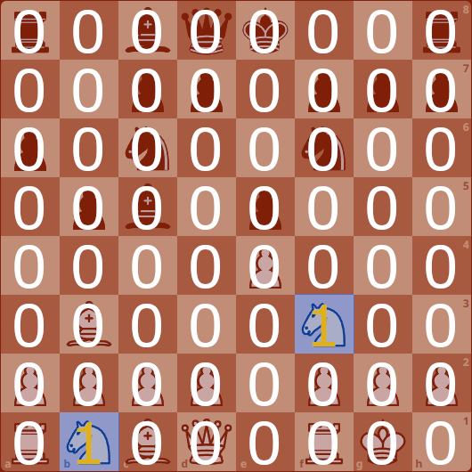
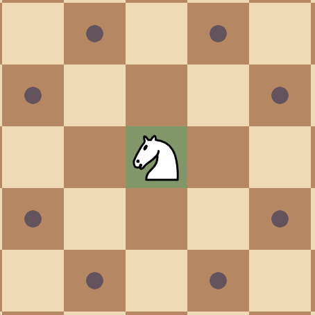
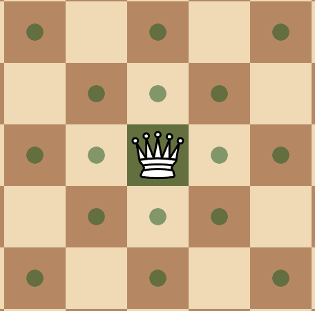

# SHORT EXPLANATION OF BITBOARDS **MAGIC**

**Magic** is not actually magic and is pretty simple once you understand it. :)

## TABLE OF CONTENTS (TOC)
- [SHORT EXPLANATION OF BITBOARDS **MAGIC**](#short-explanation-of-bitboards-magic)
  - [TABLE OF CONTENTS (TOC)](#table-of-contents-toc)
  - [USEFULL CHESS ENGINE PROGRAMMING RESOURCES AND INSPIRATIONS:](#usefull-chess-engine-programming-resources-and-inspirations)
  - [BITWISE LOGIC OPERATIONS](#bitwise-logic-operations)
      - [NOT ( ~ )](#not---)
      - [AND ( \& )](#and---)
      - [OR ( | )](#or---)
      - [XOR ( ^ )](#xor---)
      - [LEFT SHIFT ( \<\< ) --- RIGHT SHIFT ( \>\> )](#left-shift--------right-shift---)
  - [BITBOARDS](#bitboards)
  - [VISUALISATION - BOARD REPRESENTATION](#visualisation---board-representation)
      - [BIT \<-\> SQUARE MAPING](#bit---square-maping)
      - [EMPTY BOARD](#empty-board)
      - [WHITE PAWNS](#white-pawns)
      - [WHITE ROOKS](#white-rooks)
      - [WHITE KNIGHTS](#white-knights)
      - [BLACK PAWNS](#black-pawns)
      - [PIECES OF BOTH COLORS / BOTH OCCUPANCIES](#pieces-of-both-colors--both-occupancies)
  - [HOW PIECES MOVE (ATTACK)](#how-pieces-move-attack)
      - [HOW PIECES MOVE:](#how-pieces-move)
      - [JUMPING](#jumping)
      - [SLIDING](#sliding)
  - [MOVE GENERATION](#move-generation)
    - [JUMPING PIECES (PAWN, KNIGTH, KING)](#jumping-pieces-pawn-knigth-king)
    - [SLIDING PIECES (ROOK, BISHOP, QUEEN)](#sliding-pieces-rook-bishop-queen)

## USEFULL CHESS ENGINE PROGRAMMING RESOURCES AND INSPIRATIONS:

Page: Chess Programming Wiki <br>
Link: https://www.chessprogramming.org/Main_Page <br>
Accesed: 30.09.2025 <br>

Autor: *Chess Programming* <br>
Playlist: *Bitboard CHESS ENGINE in C* <br>
Link: https://youtube.com/playlist?list=PLmN0neTso3Jxh8ZIylk74JpwfiWNI76Cs&si=1iO9pkzlV3qYphHo <br>
Accesed: 30.09.2025 <br>

Autor: *Bluefever Software* <br>
Playlist: *Chess Engine In C* <br>
Link: https://youtube.com/playlist?list=PLZ1QII7yudbc-Ky058TEaOstZHVbT-2hg&si=xgUfMKpWOD7PJGkN <br>
Accesed: 30.09.2025 <br>

Author: *Sebastian Lague* <br>
Title: *Coding Adventure: Chess* <br>
Link: https://www.youtube.com/watch?v=U4ogK0MIzqk <br>

Author: *Sebastian Lague* <br>
Title: *Coding Adventure: Making a Better Chess Bot* <br>
Link: https://www.youtube.com/watch?v=_vqlIPDR2TU <br>

## BITWISE LOGIC OPERATIONS
#### NOT ( ~ )
```
~ 0 0 1 1 0 0 1
  -------------
  1 1 0 0 1 1 0 
```
#### AND ( & ) 
```
  1 1 0 0
& 1 0 1 0
  -------
  1 0 0 0
```
#### OR ( | )
```
  1 1 0 0
| 1 0 1 0
  -------
  1 1 1 0
```
#### XOR ( ^ )

```
  1 1 0 0
^ 1 0 1 0
  -------
  0 1 1 0
```
#### LEFT SHIFT ( << ) --- RIGHT SHIFT ( >> )
`- overflowing bit is discarded` <br>
`- filling with zeros` <br>
`- left and right shift is equivalent` <br>

```
1 1 0 0 1 0 1 1 << 1
---------------
1 0 0 1 0 1 1 0 
```
```
1 1 1 1 1 1 1 1 << 5
---------------
1 1 1 0 0 0 0 0
```

## BITBOARDS

```cpp
// alias for our type
using U64 = uint64_t;
```
</br>

```cpp
// ver 1
// 12 bitboards each for one color_piece

U64 white_pawn    = 0ULL;
U64 white_rook    = 0ULL;
U64 white_knight  = 0ULL;
U64 white_bishop  = 0ULL;
U64 white_queen   = 0ULL;
U64 white_king    = 0ULL;

U64 black_pawn    = 0ULL;
U64 black_rook    = 0ULL;
U64 black_knight  = 0ULL;
U64 black_bishop  = 0ULL;
U64 black_queen   = 0ULL;
U64 black_king    = 0ULL;
```
</br>

```cpp
// ver 2
// 2 for color
// 6 for each piece type

U64 white   = 0ULL;
U64 black   = 0ULL;

U64 pawn    = 0ULL;
U64 rook    = 0ULL;
U64 knight  = 0ULL;
U64 bishop  = 0ULL;
U64 queen   = 0ULL;
U64 king    = 0ULL;

// how to get color_pawn bitboard
U64 white_pawn = white & pawn;
```
</br>

```cpp
// ver 3 (1.b)
// 12 bitboards but in array

enum class PIECE{
    // pawn, rook, knight, bishop, queen, king
    // white pieces
    P, R, N, B, Q, K, 
    // black pieces
    p, r, n, b, q, k
};

U64 bitboards[12] = 0ULL;
``` 
</br>

## VISUALISATION - BOARD REPRESENTATION

#### BIT <-> SQUARE MAPING

source:
https://www.chessprogramming.org/Square_Mapping_Considerations

#### EMPTY BOARD


#### WHITE PAWNS


#### WHITE ROOKS


#### WHITE KNIGHTS


#### BLACK PAWNS


#### PIECES OF BOTH COLORS / BOTH OCCUPANCIES


## HOW PIECES MOVE (ATTACK)

#### HOW PIECES MOVE:

We can split all pieces into 2 categories:
- jumping
  - pawn
  - knight
  - king
- sliding
  - rook
  - bishop
  - queen

#### JUMPING
<div>
  
  
  
</div>

#### SLIDING
<div>



</div>

## MOVE GENERATION

### JUMPING PIECES (PAWN, KNIGTH, KING)

They just move to a square. They can't be blocked. If destination square is empty or with an enemy piece on it, jumping piece can move there.

Thanks to bitboards (bitboards are just numbers - bits) it is simply a bit shift.
<div>


</div>

<br>

```cpp
// for white pawn
U64 pawn_possition;
U64 left_attack = pawn_possition << 7;
U64 right_attack = pawn_possition << 9;
U64 pawn_attacks = left_attack | right_attack;
```
For pawn on e4 we get correct attacks. But when pawn is on the edge - file A or H - attacks will be incorrect.

```
     a b c d e f g h
 
 8   0 0 0 0 0 0 0 0   8
 7   0 0 0 0 0 0 0 0   7
 6   0 0 0 0 0 0 0 0   6
 5   0 0 0 1 0 1 0 0   5
 4   0 0 0 0 P 0 0 0   4
 3   0 0 0 0 0 0 0 0   3
 2   0 0 0 0 0 0 0 0   2
 1   0 0 0 0 0 0 0 0   1
 
     a b c d e f g h
```

That's how it will look like.

```
    a b c d e f g h      |      a b c d e f g h
                         | 
8   0 0 0 0 0 0 0 0   8  |  8   0 0 0 0 0 0 0 0   8
7   0 0 0 0 0 0 0 0   7  |  7   0 0 0 0 0 0 0 0   7
6   0 0 0 0 0 0 0 0   6  |  6   1 0 0 0 0 0 0 0   6
5   0 1 0 0 0 0 0 0   5  |  5   0 0 0 0 0 0 1 0   5
4   P 0 0 0 0 0 0 1   4  |  4   0 0 0 0 0 0 0 P   4
3   0 0 0 0 0 0 0 0   3  |  3   0 0 0 0 0 0 0 0   3
2   0 0 0 0 0 0 0 0   2  |  2   0 0 0 0 0 0 0 0   2
1   0 0 0 0 0 0 0 0   1  |  1   0 0 0 0 0 0 0 0   1
                         | 
    a b c d e f g h      |      a b c d e f g h

'P' marks pawn position
```

That's why we have to use mask. <br>
When calculating right attack we use NOT_A_FILE mask and NOT_H_FILE for left attack.<br>
The same principle aplies for knight and king attacks.<br>
\*For knight we have to also use NOT_AB_FILE and NOT_GH_FILE because knight can move not 1 but 2 square in horizontal direction. So while standing on G file bit 'overflows' to A file, and while standing on H file it overflows up to B file. That's why we have to mask to files (AB or GH).

```
      NOT_A_FILE         |         NOT_H_FILE
------------------------ | ------------------------
    a b c d e f g h      |      a b c d e f g h
                         | 
8   0 1 1 1 1 1 1 1   8  |  8   1 1 1 1 1 1 1 0   8
7   0 1 1 1 1 1 1 1   7  |  7   1 1 1 1 1 1 1 0   7
6   0 1 1 1 1 1 1 1   6  |  6   1 1 1 1 1 1 1 0   6
5   0 1 1 1 1 1 1 1   5  |  5   1 1 1 1 1 1 1 0   5
4   0 1 1 1 1 1 1 1   4  |  4   1 1 1 1 1 1 1 0   4
3   0 1 1 1 1 1 1 1   3  |  3   1 1 1 1 1 1 1 0   3
2   0 1 1 1 1 1 1 1   2  |  2   1 1 1 1 1 1 1 0   2
1   0 1 1 1 1 1 1 1   1  |  1   1 1 1 1 1 1 1 0   1
                         | 
    a b c d e f g h      |      a b c d e f g h
```


```cpp
// correct attack function for pawn
U64 pawn_attaks(int square, int color){
    U64 piece_position = 1Ull << square;
    if(color == static_cast<int>(COLOR::white)){
        // bit shift and mask overflowing bits
        return ((piece_position << 9) & NOT_A_FILE) | ((piece_position << 7) & NOT_H_FILE);
    }
    
    // bit shift and mask overflowing bits
    return ((piece_position >> 7) & NOT_A_FILE) | ((piece_position >> 9) & NOT_H_FILE);
}
```

### SLIDING PIECES (ROOK, BISHOP, QUEEN)
#### Introduction
Generating sliding pieces attacks is not as simple as jumping pieces, because other pieces may block their path. <br>
Naive version of algorithm is to loop through each square in all directions and check for blockers (blocking pieces). <br>
The problem with this solution is that it is slow. If we want to make it faster we can make something called lookup tables; Lookup tables contains attacks for all possible board configurations (to be more precise for all possible blocker placements/configurations). We sacrifice space (bigger memory usage) for time (faster algorithm). It's called space-time tradeoff. <br>
#### Relevant Squares / Relevant Occupation
So how many configurations of blockers are there? <br>
<br>
First thing first, remember that we look at all attacked squares, no matter is there a friendly or enemy piece, because in both scenarious we count this square as attacked and occupied. The distinction between friendly and enemy piece will be made by move generator, now we're just writing functions that gives us attacked squares. <br>
<br>
That little ditail is very helpfull for us. 


<div>


</div>

If we were to consider all squares that rook sees (left picture), we would have to consider 2^14 = 16384 posible blockers configurations, however thanks to that little ditail mentioned above we have to consider only 2^12 = 4096, which is 4 times smaller number. <br>
Squares that we take into consideration are called **relevant squares** or **relevant occupation**. <br>
<br>
We can skip board edges (1st and 8th ranks and A and B files) while taking into consideration, since it doesn't matter if there is a piece or not. Even if there is a piece it will not block anything because that is an edge, ther are not futher squares in that direction. <br>
<br>
If you have problem understanding this look at this video where Sebastian Lague explains it with visualisation (timestamp added): [Coding Adventure: Making a Better Chess Bot](https://youtu.be/_vqlIPDR2TU?si=tvZWBGOiS-pFTVqb&t=1966)

#### Relevant Occupancy Count

Number of *relevant squres* depends on square. For rook, in corners there are 12 (right picture), on the edges 11 and in the center 10. You can see that on picture belowe (blue = 12, green = 11, yellow = 10)<br>


For bishop it is very similar. <br>

```cpp
// number of relevant squares for each square on a board for a bishop
U64 bishop_relevant_occupancy_count[64] = {
    6, 5, 5, 5, 5, 5, 5, 6, 
    5, 5, 5, 5, 5, 5, 5, 5,
    5, 5, 7, 7, 7, 7, 5, 5,
    5, 5, 7, 9, 9, 7, 5, 5,
    5, 5, 7, 9, 9, 7, 5, 5,
    5, 5, 7, 7, 7, 7, 5, 5,
    5, 5, 5, 5, 5, 5, 5, 5,
    6, 5, 5, 5, 5, 5, 5, 6
};

// number of relevant squares for each square on a board for a rook
U64 rook_relevant_occupancy_count[64] = {
    12, 11, 11, 11, 11, 11, 11, 12, 
    11, 10, 10, 10, 10, 10, 10, 11,
    11, 10, 10, 10, 10, 10, 10, 11,
    11, 10, 10, 10, 10, 10, 10, 11,
    11, 10, 10, 10, 10, 10, 10, 11,
    11, 10, 10, 10, 10, 10, 10, 11,
    11, 10, 10, 10, 10, 10, 10, 11,
    12, 11, 11, 11, 11, 11, 11, 12
};
```

#### Magic Numbers (not that magical)

Now that we know what *relevant occupancy* and *relevant occupancy count* is we can move on to magic numbers. <br>
How do they work and how we generate them. <br>

Our main goal is to make fast lookup table - table with all attacks onfigurations. <br>

**Hash table** <br>
First thing that comes to mind might be map<square_index><both_occupancy_bitboard>. Implementation of std::map is hash table. So for each lookup these steps would occour:
- passing 2 arguments: int and U64
- calling hash function (takes some time to move arguments and function on stack, and to calculate hash)
- check for collisions
- resolve collision
- return value

That's a lot of unnecesary load out. We need something even faster than that. <br>

**Contiguous array** <br>
You could ask yourself: why not make table 64 x MAX_U64 (`arr[64][MAX_U64]`). Easy answer is that it would be enourmously big, MAX_U64 is **18,446,744,073,709,551,615**. We dont have that much memmory.
<br>

**Magic bitboards - perfect hashing alogrithm** <br>
>**Magic Bitboards**, a multiply-right-shift perfect hashing algorithm to index an attack bitboard database - which leaves both line-attacks of bishop or rook in one run.
source: [Magic Bitboards (Chess Programming Wiki)](https://www.chessprogramming.org/Magic_Bitboards)

Magic bitboards is solution that uses contiguous array like in example above, but its size is drasticly redused. Instead of using U64 as second argument (dimension) we use int (512 elements for bishop and 4096 for rook).

So lookup tables look like this.

```
// attacks lookup tables
U64 bishop_attacks[64][512]
U64 rook_attacks[64][4096]

table[square_index][magic_index]
```

**Magic index - hash from perfect hasing**

```
magic_index = (relevant_occupancy * magic_number) >> (64 - relevant_occupancy_count)
```


relevant_occupancy is U64 bitboard 

relevant_occupancy = both_occupancies & mask[square_index]
magic_number = randomly generated (in precomputation phase later acces from table. One magic number per square)
relevant_occupancy_count = relevant_occupancy_count[square_index]